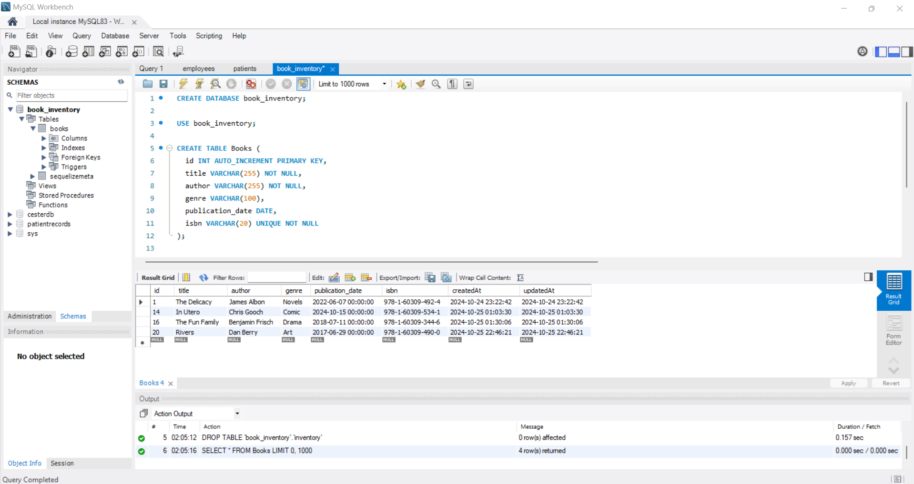
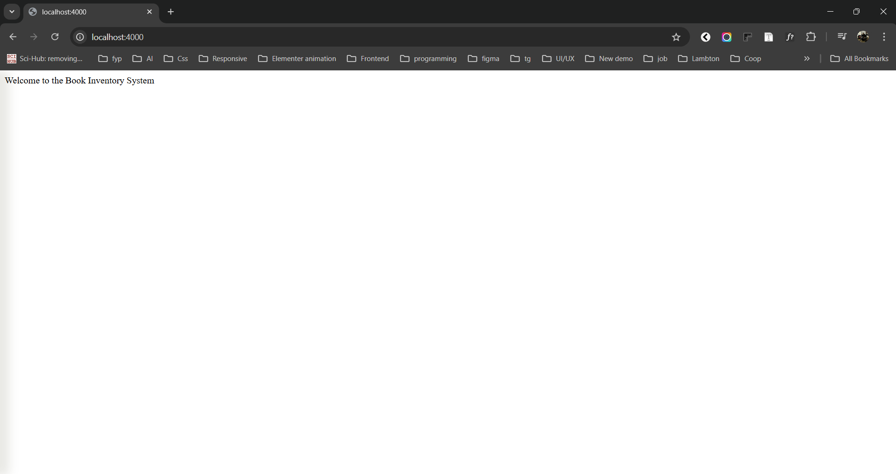
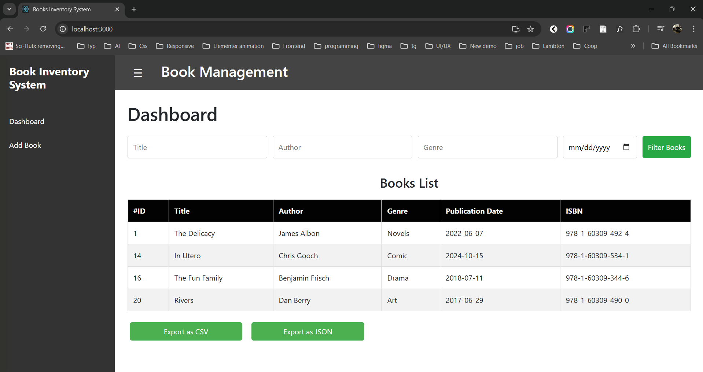
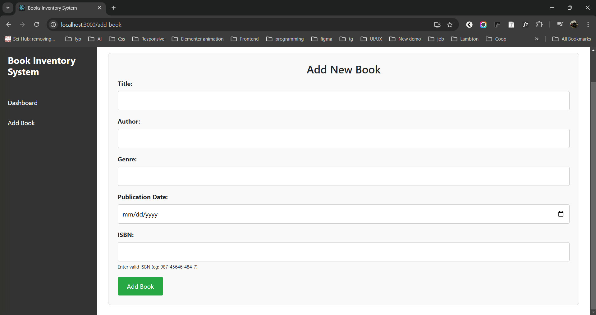
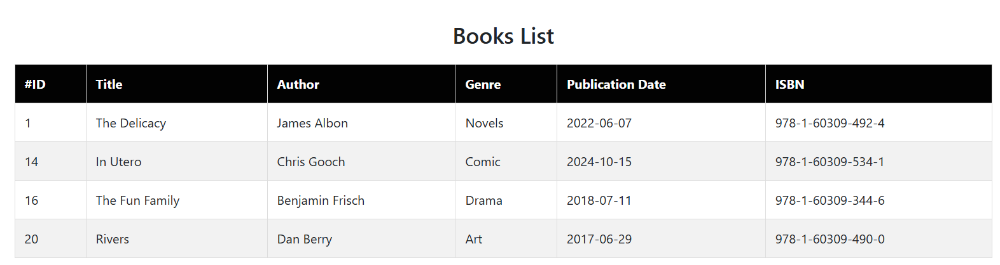
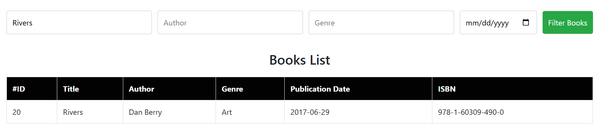
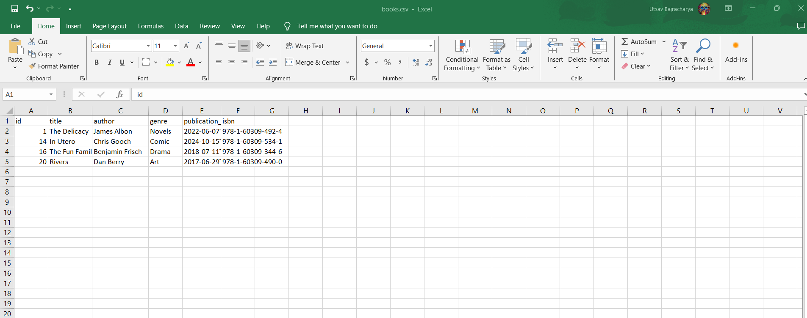
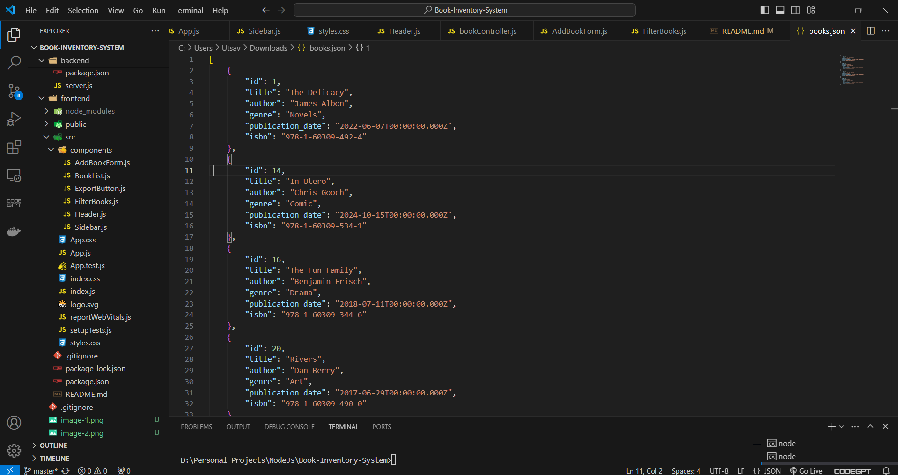

# Book-Inventory-Management-System

Book Inventory Management System is a web application that manages and organizes book records. It allows users to add, filter, view, and export book data in CSV and JSON. this application has interfaces with different components like adding books, filtering and viewing the book list, and exporting the data.

#Technologies Used
- Frontend: React, Bootstrap, CSS
- Backend: Node.js, Express
- Database: MySQL (with Sequelize ORM)

#Features
- Add Book: Add new books to the inventory with details like title, author, genre, and ISBN.
- Filter Books: Filter the list of books based on various attributes (e.g., genre, author, date).
- Books List: Display a table of books in the inventory.
- Export buttons: Export the book list to CSV or JSON formats.
- Responsive Design: Optimized for desktop and mobile devices.

#Requirements

- Download and installnstall Node.js from https://nodejs.org/en
- Download MySQL from https://dev.mysql.com/downloads/mysql/

Clone this project by running the command - git clone https://github.com/UtsavBajracharya/Book-Inventory-System in command prompt

#Installation Steps

1. Backend Setup
In the backend, we are using Node.js with Express.js for server functionality, Sequelize as the ORM, and dotenv for environment variables.

Install the following dependencies for the backend:
Navigate to the backend folder in your project and run the following commands:

- cd backend
- npm install express mysql2 sequelize sequelize-cli dotenv cors

2. Frontend Setup
In the frontend, we are using React and Bootstrap for UI, along with axios to make HTTP requests and connect to the backend API.

Install the following dependencies for the frontend:
Navigate to the frontend folder in your project and run the following commands:

- cd frontend
- npm install react-bootstrap bootstrap axios

#Configuration

MySQL Database Setup

Create a MySQL database for the application:

sql query to create database:

CREATE DATABASE book_inventory;

sql query to create table 

CREATE TABLE Books (
  id INT AUTO_INCREMENT PRIMARY KEY,
  title VARCHAR(255) NOT NULL,
  author VARCHAR(255) NOT NULL,
  genre VARCHAR(100),
  publication_date DATE,
  isbn VARCHAR(20) UNIQUE NOT NULL
);

#Run the Application

Start the Backend Server
Go to backend folder:

- npm start
- The backend will be running on http://localhost:4000.

Start the Frontend Server
Go to frontend folder:

- npm start
- The frontend will be running on http://localhost:3000.

#Add Book

#Book List

#Filter Books

#Download as CSV

#Download as JSON

